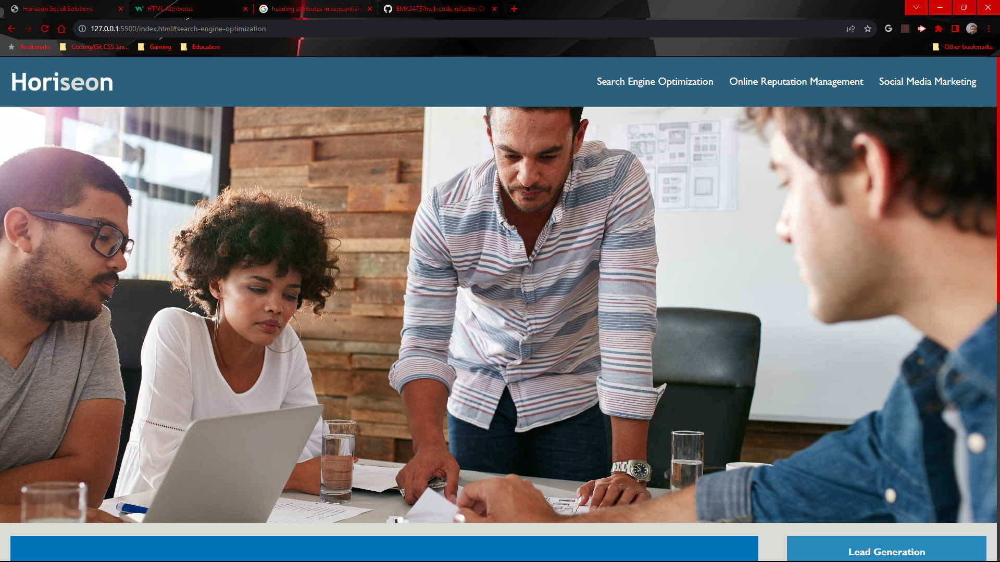

# HW1-Code-Refactor
## Challenge-1
For this first challenge, I:
- Refactored the existing website to optimize the codebase for accesibility standards, and so site is better optimized for search engines.

## What I changed:
- Added an "alt" attribute to each image
- Added an "alt" attribute to each icon
- Adjusted semantics in logical order with appropriate tags in place of (div)
> including (nav) (aside) (section) and (footer)
- Changed individual classes to ids
- Commented each change in html and css file
- Created a Concise Website Title

Screenshot:

Deployable Link:
https://emk2473.github.io/hw1-code-refactor/